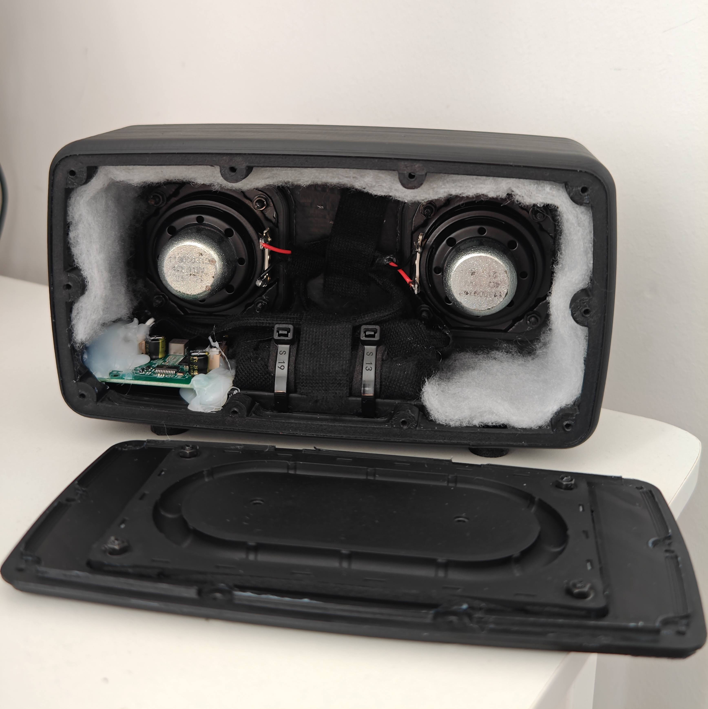
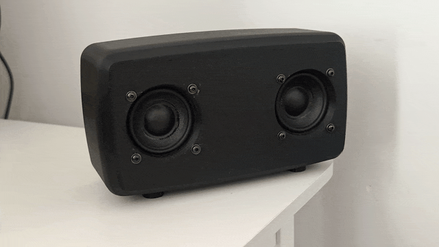

# 🔊 Advanced Custom Acoustic Systems — Hardware Showcase

  
  &nbsp;
  

> **Note:** This repository contains the architectural overviews, DSP tuning strategies, and CAD files (`/stl_files`) for two distinct, fully functional 3D-printed acoustic enclosures I engineered from scratch.

## 📌 Project Overview
This showcase demonstrates a full-cycle hardware engineering process, **developed entirely solo from scratch**. Driven by a hands-on approach to problem-solving, I leveraged **AI-assisted research** to independently master the required multidisciplinary skills—from CAD modeling in Autodesk Fusion to electromechanical assembly, power management, and acoustic signal processing. 

The primary goal was to overcome complex acoustic challenges (resonance, standing waves, internal volume constraints) within small 3D-printed form factors, without relying on pre-existing kits or external engineering support.

---

## 🛠️ Iteration 1: Spherical TWS System (Acoustic Geometry)
The first iteration focused on geometric acoustic treatment, power efficiency, and wireless synchronization. Built as a paired set for True Wireless Stereo (TWS) operation.

* **Acoustic Design (600ml):** Engineered a spherical closed-box enclosure. The internal walls feature a custom 3D-printed **pyramid diffuser matrix** to break up standing waves and minimize unwanted internal resonance.
* **Hardware Specs:** Driven by a single 4-ohm 5W full-range driver per unit, powered by a Bluetooth/TWS amplifier with Type-C and AUX inputs.
* **Power Management:** Operates efficiently on a single 18650 lithium-ion cell per unit, delivering exceptional battery life for long-duration playback.

  
  &nbsp;
  

---

## 🚀 Iteration 2: High-SPL Waterproof System (DSP & Power)
The second iteration pushed the limits of small-enclosure acoustics (<1 Liter), focusing on deep low-frequency extension, high current delivery, and weather resistance.

  

* **Driver Architecture:** Features dual front-firing 4-ohm 11W drivers, physically coupled with a large rear **Passive Radiator** to dramatically extend bass response in a sub-1L volume.
* **High-Current Power (BMS):** Engineered a 1S2P battery pack using high-drain LG HG2 18650 cells. Integrated a dedicated Battery Management System (BMS) to safely handle the high amperage spikes during heavy bass transients.
* **Digital Signal Processing (DSP):** Powered by a 2x10W amplifier. I utilized **ACPWorkbench** to digitally tune the system, surgically cutting resonant frequencies and applying custom EQ curves to maximize high-fidelity output.
* **Acoustic Dampening:** The internal volume is packed with poly-fill material to artificially increase the acoustic compliance and reduce back-wave reflections.

  
  &nbsp;
  

---

## 🔩 Manufacturing & Assembly Pipeline
Both systems were manufactured using strict prototyping tolerances and mechanical isolation techniques.

* **3D Printing:** Sliced and printed using Sunlu PLA+ 2.0 (Black).
* **Vibration Isolation:** Custom-designed and printed **TPU (Thermoplastic Polyurethane)** feet to decouple the speakers from resting surfaces, preventing rattle.
* **Waterproofing & Sealing:** The advanced model is fully waterproofed. Assembly utilizes M3 screws and hex nuts, secured with high-density sponge isolation tape (gaskets) and dielectric grease on the mating surfaces to ensure a 100% airtight and watertight acoustic chamber.

---

## 📂 Repository Contents
* `/stl_files` - Contains the 3D printable CAD models for both iterations.
* `/media` - High-resolution photos, CAD screenshots, and performance GIFs.

## 📬 Contact
* **Email:** [omerfaruk.kus@outlook.com](mailto:omerfaruk.kus@outlook.com)
* **LinkedIn:** [linkedin.com/in/omrfrkkus](https://linkedin.com/in/omrfrkkus)
