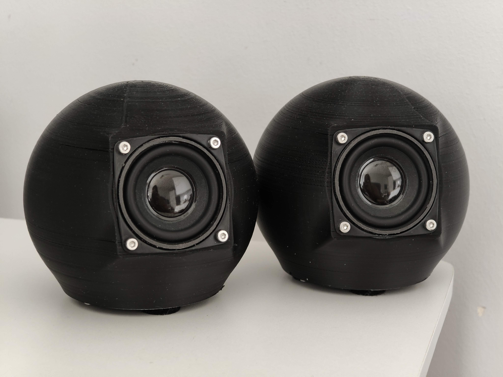

# 🔊 Advanced Custom Acoustic Systems — Hardware Showcase

  

> **Note:** This repository contains the architectural overviews, DSP tuning strategies, and CAD files (`/stl_files`) for two distinct, fully functional 3D-printed acoustic enclosures I engineered from scratch.

## 📌 Project Overview
This showcase demonstrates a full-cycle hardware engineering process, **developed entirely solo from scratch**. Driven by a hands-on approach to problem-solving, I leveraged **AI-assisted research** to independently master the required multidisciplinary skills—from CAD modeling in Autodesk Fusion to electromechanical assembly, power management, and acoustic signal processing. 

The primary goal was to overcome complex acoustic challenges (resonance, standing waves, internal volume constraints) within small 3D-printed form factors, without relying on pre-existing kits or external engineering support.

---

## 🚀 Iteration 2: High-SPL Waterproof System (DSP & Power)
*(Featured in the demo above)*

Pushing the limits of small-enclosure acoustics (<1 Liter), this advanced system focuses on deep low-frequency extension, high current delivery, and weather resistance.

> **🖨️ Open Source Hardware:** The STL files, complete BOM, and detailed build instructions for this model are publicly available on [Printables: High-SPL Custom 3D Printed Speaker (DSP Tuned)](https://www.printables.com/model/1845016-custom-3d-printed-speaker-dsp-tuned).

* **Driver Architecture:** Features dual front-firing 4-ohm 11W Neodymium long-stroke drivers, physically coupled with a massive 135x75mm rear **Passive Radiator** to dramatically extend bass response in a sub-1L volume.
* **High-Current Power (BMS):** Engineered a 1S2P battery pack using high-drain LG HG2 18650 cells. Integrated a dedicated Battery Management System (BMS) to safely handle the high amperage spikes during heavy bass transients.
* **Digital Signal Processing (DSP):** Powered by a 2x10W amplifier. I utilized **ACPWorkbench** to digitally tune the system, surgically cutting resonant frequencies and applying custom EQ curves to maximize high-fidelity output.
* **Modular Acoustic Dampening:** The internal volume utilizes an adjustable poly-fill dampening system secured via hook-and-loop (Velcro) strips on the inner walls. This allows for rapid physical acoustic tuning (switching between a clinical flat response or maximum punch) without permanent adhesives.

  
  &nbsp;
  

### 🎥 Acoustic Performance & Stress Tests
Real-world volume, excursion, and dynamic output testing under load:

  
  &nbsp;
  

| Test Video | Test Description | Duration |
| :--- | :--- | :---: |
| 🔊 [Speaker Project %80 Volume Test](https://youtu.be/s3fn8n4pkiM) | High dynamic range evaluation measuring bass response, clarity, and driver linearity. | `0:41` |
| 🔊 [Speaker Project Max Volume Test](https://youtu.be/kctdLXoFfMA) | Full-power stress test verifying BMS surge handling and structural resonance elimination. | `0:20` |

---

## 🛠️ Iteration 1: Spherical TWS System (Acoustic Geometry)
The initial prototype focused on geometric acoustic treatment, power efficiency, and wireless synchronization. Built as a paired set for True Wireless Stereo (TWS) operation.

> **🖨️ Open Source Hardware:** The STL files and complete build instructions for this model are publicly available on [Printables: Sphere TWS Speakers](https://www.printables.com/model/1825186-sphere-tws-speakers).

* **Acoustic Design (600ml):** Engineered a spherical closed-box enclosure. The internal walls feature a custom 3D-printed **pyramid diffuser matrix** to break up standing waves and minimize unwanted internal resonance.
* **Hardware Specs:** Driven by a single 4-ohm 5W full-range driver per unit, powered by a Bluetooth/TWS amplifier with Type-C and AUX inputs.
* **Power Management:** Operates efficiently on a single 18650 lithium-ion cell per unit, delivering exceptional battery life for long-duration playback.

  
  &nbsp;
  
  &nbsp;
  

### 🎥 Spherical TWS Acoustic Tests
Acoustic performance and distortion tests in dual-speaker paired mode:

  
  &nbsp;
  

| Test Video | Test Description | Duration |
| :--- | :--- | :---: |
| 🔊 [Sphere Speaker TWS %70 Volume Test](https://youtu.be/pdXcFrA3jAQ) | Mid-high volume clarity test with wireless stereo separation in a 600ml spherical chamber. | `0:56` |
| 🔊 [Sphere Speaker TWS Max Volume Test](https://youtu.be/vx8ZYlDZn7Q) | Maximum output test assessing enclosure rigidness and passive anti-resonance effectiveness. | `1:01` |

---

## 🔩 Structural Engineering & Manufacturing Pipeline
Both systems were manufactured with a strict focus on structural integrity, utilizing custom slicing profiles and mechanical isolation techniques.

* **Internal Bracing & Infill:** Designed custom internal ribbing structures within the CAD models. Slicer profiles were optimized using **Gyroid infill** (minimum 4-5 walls) to provide multi-directional structural strength, preventing panel resonance and acoustic energy loss.
* **Hermetic Chamber Sealing:** Acoustic performance relies on a strict closed-box system. To guarantee a 100% airtight seal for the passive radiator and drivers, the top mating layers were printed utilizing a slicer **"Ironing"** pass to create a glass-flat surface. External assemblies are secured with M3 screws, EVA foam isolation tape (gaskets), and dielectric grease. Internal wire routing holes connecting the acoustic chamber to the electronics bay were hermetically sealed with adhesive.
* **Internal Rattle Prevention:** To prevent internal wiring from vibrating against the plastic walls during high SPL output, all cables were wrapped in automotive fleece tape and secured directly to the chassis.
* **Electromechanical Safety:** Strict safety protocols were implemented for power management, including proper BMS integration and spot-welding/soldering procedures to prevent thermal runaway or short circuits in the 18650 lithium-ion cells.
* **Vibration Isolation:** Designed and printed custom **TPU (Thermoplastic Polyurethane)** feet to decouple the speakers from resting surfaces, preventing external rattle and acoustic coloration.
* **Extreme Stress Testing:** Prior to electronic assembly, the empty enclosures underwent severe dynamic load testing—successfully withstanding the full dynamic weight of an adult jumping on them without any mechanical deformation, micro-fractures, or seal failures.

---

## 📂 Repository Contents
* `/stl_files` - Contains the 3D printable CAD models for both iterations.
* `/media` - High-resolution photos, CAD screenshots, and performance GIFs.

## 📬 Contact
* **Email:** [omerfaruk.kus@outlook.com](mailto:omerfaruk.kus@outlook.com)
* **LinkedIn:** [linkedin.com/in/omrfrkkus](https://linkedin.com/in/omrfrkkus)
